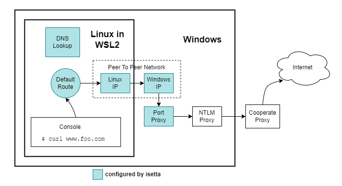

# Isetta - Painless Cooperate Proxy in WSL2


`isetta` is a small command line tool to configure your Windows WSL2 environment to work through a company proxy. `isetta` runs inside WSL2 and requires [Px](https://github.com/genotrance/px) or a different proxy forwarder to exist on the Windows side.

Disclaimer: This is a hobbyist software project which is not related to [the 50ies Isetta microcar](https://en.wikipedia.org/wiki/Isetta). However, the software tool tries to be as nimble and puristic as this old beauty 😉.


## Prerequisites

- [Px proxy](https://github.com/genotrance/px)
- WSL2 already installed

Note: [gontlm-proxy](https://github.com/bdwyertech/gontlm-proxy) and [winfoom](https://github.com/ecovaci/winfoom) look like good replacements for Px proxy but I did not test them.


## Usage

````sh
$ sudo isetta
Info: Detecting network connection
Info: Found internet access via proxy
Info: Done setting up Linux network via proxy

$ source <(isetta -env-settings)
$ curl www.google.com
````


## Install

`isetta` comes as a single binary which should be copied to a directory inside your `PATH`. 

I suggest to have your own local `/home/your-username/bin` directory which is added to the `PATH` environment variable, either in `.bashrc` (bash) or `.zshrc` (zsh)

Example:
```sh
# considering a local ~/bin directory exists
cd ~/bin
wget https://github.com/samba2/isetta/releases/download/<version number>/isetta
chmod u+x isetta
```

If accessing the internet is problematic (this is probably the reason why you want to use isetta 😉), you can also:
- use your Windows browser and download the binary to the Windows downloads folder
- copy it from there to your Linux environment (e.g. `~/bin/`)

````sh
cp /mnt/c/<User>/Downloads/isetta ~/bin/
chmod u+x isetta
````

## Configure

`isetta` needs to know your internal (aka "cooperate") DNS server. This information is stored in the `~/.isetta` config file in [TOML format](https://toml.io/en/).


### Minimal Setup

This copy+paste snippet create a minimal configuration which just needs your cooperate DNS server to be adjusted.

````sh
cat > ~/.isetta <<EOL
[dns]
# adjust this to your company's DNS server address
internal_server = "42.42.42.42"
EOL
````

There are various ways to find out about your cooperate DNS server. Here is one way (which worked for me):
- in Windows, run `cmd.exe`
- enter `nslookup`
- you enter an interactive prompt, the second line `Address` tells you the DNS server


### Further Config Options

For an example configuration file containing all supported options and their description, see [here](./example-isetta.toml).


## Running

To perform the network configuration (main use case), run:
```sh
$ sudo isetta
```

Additionaly, `isetta` also prints out the correct `HTTPS_PROXY` variables:

```sh
$ isetta -env-settings
```

Example output when connected to a cooperate network with internet access via proxy:
````sh
export HTTPS_PROXY=http://169.254.254.1:3128
export HTTP_PROXY=http://169.254.254.1:3128
export https_proxy=http://169.254.254.1:3128
export http_proxy=http://169.254.254.1:3128
export NO_PROXY=localhost,127.0.0.1,169.254.254.1
````

Output with direct internet connection (unset all proxy variables):
````sh
unset HTTPS_PROXY
unset HTTP_PROXY
unset https_proxy
unset http_proxy
unset NO_PROXY
````

To let `isetta` do both, configure your network and set the `HTTPS_PROXY` variables of your current shell correctly, run:
````sh
# configure network and 
# set the proxy environment variables of this shell
sudo isetta && source <(isetta -env-settings)
````

## Supported Connection Scenarions

`isetta` configures WSL2 internet access for these scenarios:
- connected to cooperate network, internet via proxy
- connected to cooperate network via VPN, internet via proxy
- directly connected

`isetta` automatically detects these scenarios. To update your network configuration, you only need to re-run the above commands.


## sudo Rights and Elevated Privileges

`isetta` does configuration changes on the Linux and on the Windows side. For this, it needs Linux root and Windows admin rights.

For Linux root rights, `sudo` is used. For admin rights on Windows, `isetta` ships with an embedded copy of [`gsudo`](https://github.com/gerardog/gsudo) and, **if needed, will prompt the user for it's Windows admin credentials**.


## Better Living With sudo

### No password prompt
`sudo` requires you to enter your Linux root password. To make using `isetta`  more convenient, you can disable this check.
Open either `/etc/sudoers` directly or (e.g. on Ubuntu) create a dedicated new config file like `/etc/sudoers.d/no_wsl_sudo_pw`.

Then, add *one* of the following lines:

````sh
# assuming your username is "peter"
# ask for no password when executing /home/peter/bin/isetta
peter ALL= NOPASSWD: /home/peter/bin/isetta
````

Alternatively, you can disable `sudo` password checking entirely:
````
peter ALL=(ALL) NOPASSWD: ALL
````

### Inherit environment variables from child shell

By default, executing `sudo` gives a minimal shell with almost none of the environment variables of the original user shell (run `sudo env` to see what you've got). To disable this behaviour and inherit the user's environment variables, the following line needs to be set in the `sudo` config files:

````
Defaults !env_reset
````

This config change is helpful if your copy of `isetta` is living in your own private `bin`  directory which part of your user's `PATH` variable. Through this config change, this `PATH` is also available for the root user.

For more background, read on [here](https://unixhealthcheck.com/blog?id=363).

You can access the sudo config file by running `sudo visudo`.

### Other Visudo Setups

Depending your environment, you may need to add the following to your sudo config. 

1. Add the following to the `secure_path` variable:
```
:/home/<user>/bin:/mnt/c/Windows/system32:/mnt/c/Windows/System32/WindowsPowerShell/v1.0/
```

2. Add the `env_keep` variable line as:
```
Defaults        env_keep += "PATH"
```

## Additional NO_PROXY Configuration

`isetta` detects existing `NO_PROXY` configurations at two locations:
1. an existing `NO_PROXY` environment variable
2. a list of hosts in the *network/no_proxy* section of the `.isetta` config file. See [here](./example-isetta.toml) for an example.

Entries of both locations will be appended to the `export NO_PROXY` line when running `isetta -env-settings`.


## Networking Overview

As already mentioned, `isetta` was tested in these WSL2 networking scenarios:
- connected to cooperate network, internet via proxy
- connected to cooperate network via VPN, internet via proxy
- directly connected

The first two scenarios require the same setup effort. The direct connection scenario is supported to also switch back from a cooperate network connection.


### Connected To Cooperate Network

This is rather complex:


    
*WSL2 internet access via cooperate proxy*

`isetta` performs these configurations:
- create a new point-to-point network between WSL2 and Windows. This became necessary as the default WSL2-to-Windows network used a subnet which was sometimes blocked by a local firewall and/ or was not routed via the VPN.
- configure a [Windows port proxy to allow WSL2 traffic to talk to Px proxy](https://learn.microsoft.com/en-us/windows/wsl/networking#accessing-a-wsl-2-distribution-from-your-local-area-network-lan) on Windows
- adjust the default route on the Linux side
- set the DNS lookup configuration in `/etc/resolve.conf` to the configured internal (aka cooperate) DNS server

### Direct Connection

`isetta` allows you to easily switch back the above configuration if it detects a direct network connection. In this case:
- the DNS server in `/etc/resolve.conf` is changed to the public DNS server
- if executed with the `-env-settings` flag, it unsets the `HTTPS_PROXY` variables to disable routing via Px proxy. See above for a usage example.


## Project Background
`isetta` was born out of multiple intends: 
- Existing WSL2 network config scripts were too inconvenient and also did not always "just work". 
- I was looking for a real world use-case to do something with Golang. 

The result is `isetta` - a glorified shellscript with a funky architecture 😉.


## Development

### Architecture

`isetta` is a command line application with many specific (I/O) dependencies. This makes it usually hard to automatically test.
To improve here, `isetta` uses a [ports and adapter architecture](https://8thlight.com/blog/damon-kelley/2021/05/18/a-color-coded-guide-to-ports-and-adapters.html), also known as hexagonal architecture.

the core...
- lives in [core](./core/)
- provides its [ports via interfaces](./core/ports.go)
- has no knowledge about concrete implementations
- test coverage is quite extensive and heavily backed up by mocks

the adapters...
- live in [adapter/](./adapter/)
- talk to the disk, configure Linux and Windows networking and do other OS dependent, hard-to test stuff
- should be slim and contain as little business logic as possible

dependency injection...
- manually takes place, together with general application startup in [main.go](./main.go)


### Thoughts On The Current Architecture

Although ports and adapters might seem to be a bit heavy for a simple command line app, I was aiming for simple testing of business logic, independent of the actual IO dependencies. Also, I was hoping to improve separation of concerns.

In my eyes introducing decoupled adapters improved the clarity of the code a lot. It was great to reason if this "if/else" is now part of the business logic or still belongs to the adapter.

However, looking at the heavy mocking for the core tests still feels odd. It feels like I reversely repeated the implementation.

### Executing Tests

`isetta` uses [go tags](https://mickey.dev/posts/go-build-tags-testing/) to categorize unit and integration tests.
The aim is to allow non-WSl2 users (like a CI/CD pipeline) to execute the cross platform part of the test suite.

| Description                                                       | go test tags    | make command                        |
|-------------------------------------------------------------------|-----------------|-------------------------------------|
| cross platform tests                                              | -               | `make unit-test`                    |
| cross platform tests and WSL2 specific tests (require `cmd.exe` and `powershell.exe` in path) | `wsl`  | `make unit-test-with-wsl` |
| cross platform test, WSL2 specific tests and interactive tests | `wsl,interactive` | `make unit-test-with-wsl-interactive` |

Hint: To configure the go tags in VS Code, add e.g. `"go.testTags": "wsl,interactive"` to your `.settings.json` file.

## Credits

- to the colleges how invested sweat and tears to come up with working Powershell scripts for the WSL2 proxy setup. These scripts were a crucial starting point for `isetta` 👍
- to the [Leipzig Golang meetup crew](https://www.meetup.com/de-DE/leipzig-golang/) who happen to be extraordinary friendly and supportive people 🙏🧡
